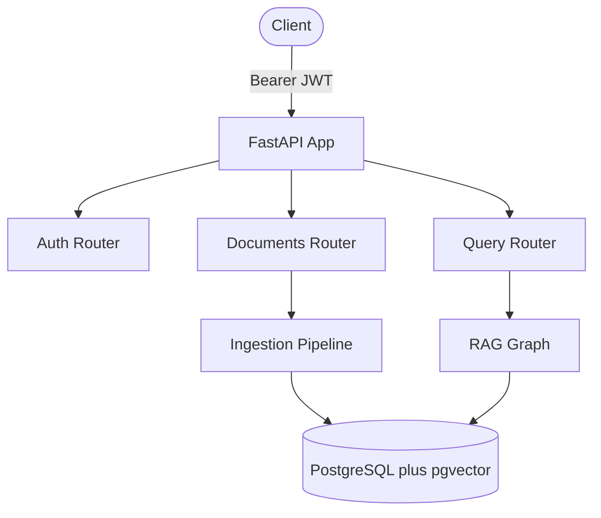
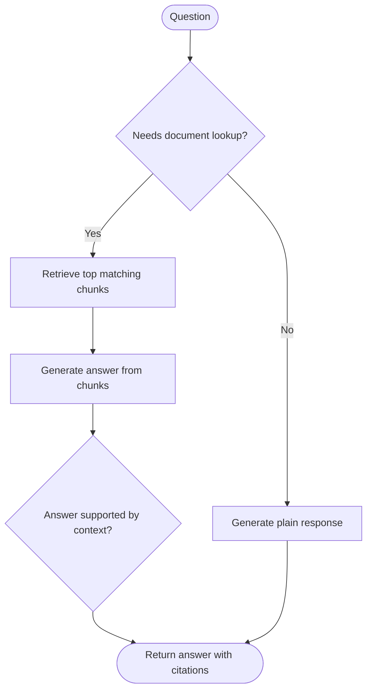
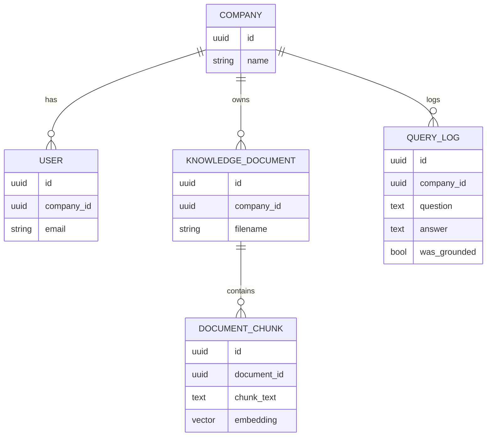

# RAG Knowledge API

A backend API where a company uploads its own documents and asks questions about them in plain English. Answers come only from the uploaded content — with citations — instead of the model's general knowledge.

Built with **FastAPI**, **PostgreSQL + pgvector**, **LangChain**, **LangGraph**, and **Gemini**.

---

## What It Does

| Step | What happens |
|---|---|
| 1. Upload | A PDF/text file is split into chunks; each chunk is embedded as a vector and stored |
| 2. Ask | A question is embedded the same way and matched against stored chunks by similarity |
| 3. Answer | An answer is generated using only the matched chunks — never the model's own knowledge |
| 4. Verify | A second check confirms the answer is actually supported before it's returned |

---

## Architecture



---

## The Query Flow

Every question runs through a small LangGraph state machine — this is what makes it *agentic* rather than a single retrieve-then-generate function.



**Router** — skips retrieval for things like "hi" or "what can you do", so a vector search only happens when it's actually needed.

**Verify** — a second, independent model call checks the generated answer against the retrieved context. The model that wrote the answer can't reliably catch its own mistakes; a separate check can.

**"I don't know" is allowed** — the generation prompt explicitly permits this. Without it, the model quietly fills gaps with outside knowledge, which defeats the point of retrieval-grounded answers.

---

## Tech Stack

| Layer | Choice |
|---|---|
| Framework | FastAPI |
| Database | PostgreSQL + `pgvector` (Supabase) |
| Chunking | LangChain `RecursiveCharacterTextSplitter` |
| Embeddings | Gemini `gemini-embedding-001` (768 dimensions) |
| Generation | Gemini `gemini-3.5-flash` |
| Orchestration | LangGraph |
| Auth | JWT (`python-jose`) + `bcrypt` |
| Testing | `pytest` |

---

## Data Model



Every document, chunk, and query is scoped to the company that owns it — one company can never see another's data.

---

## API Reference

**Auth**
| Method | Path | Description |
|---|---|---|
| POST | `/auth/signup` | Create a company + user, returns a JWT |
| POST | `/auth/login` | Log in, returns a JWT |

**Documents**
| Method | Path | Description |
|---|---|---|
| POST | `/documents/upload` | Upload a file — extracts, chunks, embeds, stores it |
| GET | `/documents` | List your company's documents |
| GET | `/documents/{id}/chunks` | View a document's chunks (debugging) |

**Query**
| Method | Path | Description |
|---|---|---|
| POST | `/query/ask` | Ask a question — runs the full graph, returns answer + citations |
| POST | `/query/test-retrieval` | See which chunks would be retrieved, without generating an answer |

Full interactive docs at `/docs` once the server is running.

---

## Example

```
POST /query/ask
→ { "question": "How many sick days do employees get?" }
← {
    "answer": "Employees receive 10 sick days at the start of each calendar year.",
    "was_grounded": true,
    "citations": [{ "document_filename": "employee_handbook.txt", "chunk_text": "..." }]
  }

POST /query/ask
→ { "question": "What is the company's dress code?" }
← {
    "answer": "I don't have enough information in the provided documents to answer that.",
    "was_grounded": true,
    "citations": [...]
  }
```

The second example shows the model correctly declining to guess, since the uploaded document never mentions a dress code.

---

## Getting Started

```bash
git clone https://github.com/YOUR_USERNAME/rag-knowledge-api.git
cd rag-knowledge-api

python -m venv venv
venv\Scripts\activate        # Windows
pip install -r requirements.txt
```

Create a `.env` file:
```
DATABASE_URL=postgresql://<user>:<password>@<host>:5432/postgres
GEMINI_API_KEY=your_gemini_api_key
JWT_SECRET_KEY=a_long_random_secret
JWT_ALGORITHM=HS256
JWT_EXPIRE_MINUTES=1440
```

Generate a secret key:
```bash
python -c "import secrets; print(secrets.token_hex(32))"
```

Run it:
```bash
uvicorn app.main:app --reload
```

The `vector` extension is enabled and all tables are created automatically on startup. Visit `http://localhost:8000/docs`.

---

## Testing

```bash
pytest -v
```

All Gemini calls (embeddings, generation, groundedness checks) are mocked, so the test suite runs in seconds and uses zero API quota.

Coverage includes:
- Document upload, chunking, and unsupported file type rejection
- The router's branching behavior — general questions skip retrieval, document questions trigger it
- The groundedness flag correctly reflecting whether an answer is flagged as supported or not
- Multi-tenant isolation between two companies
- Rejection of unauthenticated requests

---

## Future Enhancements

- Support for more file types (`.docx`, `.md`)
- An evaluation set to measure retrieval accuracy and groundedness rate over time
- Document deletion and re-ingestion
- Hybrid search (keyword + semantic) for queries with exact terms embeddings under-weight